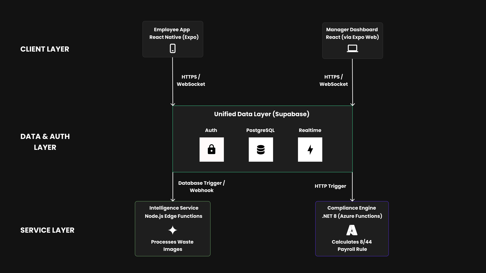

# V.A.K (Valence, Axiom, Kairos)


> **The AI-Powered Operating System for High-Compliance Hospitality.**

V.A.K is a vertical **Workforce Management System (WMS)** designed specifically for the low-margin, high-compliance restaurant industry. Unlike generic schedulers, V.A.K correlates labor data with inventory waste analytics to provide actionable operational intelligence.

Built on a **Hybrid Serverless Microservices Architecture**, it enforces strict financial compliance via an isolated .NET Engine while delivering a fluid, mobile-first experience for staff.

---

## System Architecture

We utilize a **Polyglot Monorepo** structure managed by **Turborepo** to handle parallel development across three specialized squads.



### The Microservices Topology
The system is decoupled into three distinct layers to ensure scalability and fault tolerance:

1.  **Client Layer (Frontend):**
    * **Mobile:** React Native (Expo) app for employees (Time & Attendance, Swaps).
    * **Web:** React (Expo Web) Dashboard for managers (Scheduling, Analytics).
2.  **Core Data Layer (State):**
    * **Supabase:** Handles Identity (Auth), Persistence (PostgreSQL), and Real-time subscriptions (WebSockets).
3.  **Service Layer (Intelligence & Compliance):**
    * **Intelligence Service:** Node.js Edge Functions utilizing **Google Gemini 1.5** for waste recognition.
    * **Compliance Engine:** A strictly typed **.NET 8 (C#)** microservice running on Azure Functions to calculate payroll liabilities (Alberta Rule 8/44).


    
## The "Vital 5" Features (MVP)

1.  **Unified Role-Based Access:** Single Sign-On (SSO) routing Managers to Web and Employees to Mobile.
2.  **Geo-Fenced Attendance:** GPS-verified clock-ins enforcing a <50m proximity rule.
3.  **The "Live" Schedule:** Real-time shift publishing via WebSockets (Zero-latency updates).
4.  **P2P Shift Marketplace:** Automated shift swapping workflow with Manager approval queues.
5.  **8/44 Compliance Engine:** Automated overtime calculation ensuring strict adherence to Alberta Labour Standards.

---

## Tech Stack

| Layer | Technology | Justification |
| :--- | :--- | :--- |
| **Monorepo** | **Turborepo** | High-performance build system for multi-package workspaces. |
| **Mobile** | **React Native (Expo)** | Single codebase for iOS/Android with Over-the-Air (OTA) updates. |
| **Web** | **React (Expo Web)** | Responsive manager dashboard sharing UI types with mobile. |
| **Styling** | **NativeWind** | Shared Tailwind CSS design system across Web & Mobile. |
| **Backend** | **Supabase** | PostgreSQL with Row Level Security (RLS) & Edge Functions. |
| **Engine** | **.NET 8 (C#)** | Type-safe financial calculations and compliance logic. |
| **AI** | **Google Gemini** | Multimodal analysis for food waste logs. |
| **Validation** | **Zod** | Runtime schema validation shared across the monorepo. |

---

## Repository Structure

```text
vak-monorepo/
├── apps/
│   ├── mobile/         # Employee App (Expo/React Native)
│   ├── web/            # Manager Dashboard (React/Expo Web)
│   └── api/            # (Optional) Standalone API services
├── packages/
│   ├── ui/             # Shared UI Components (NativeWind)
│   ├── config/         # Shared ESLint/TSConfig settings
│   └── types/          # The "Contract": Shared TypeScript Interfaces & Zod Schemas
├── services/
│   ├── compliance/     # .NET 8 Payroll Engine (C#)
│   └── intelligence/   # Gemini AI Edge Functions (Node.js)
└── turbo.json          # Build pipeline configuration
```

## Getting Started 
### Prerequisites
---
> Node.js >= 18

> Bun / npm / pnpm

> .NET 8 SDK (for Compliance Engine)

> Expo Go (on mobile device)

### Installation
---
1. **Clone the Monorepo:** 
```bash 
git clone https://github.com/Masroor73/vak-monorepo.git
cd vak-monorepo
```

2. Install Dependencies:
```bash
npm install 
# or
bun install
```

3. Run Development Environment:
```bash
npx turbo dev
```
This starts the Mobile App, Web Dashboard, and Mock API services concurrently.


## Security & Compliance
* Row Level Security (RLS): All database access is scoped to the user's restaurant_id at the Postgres level.

* Type Safety: We use a strict Shared Types Contract to ensure the Frontend and Backend never drift out of sync.

* Data Residency: All PII and Labor data is stored in Canada (Central) to comply with PIPEDA.

## Team & Squads
Software Architect & Tech Lead: Masroor (@Masroor73)

Squad A (Mobile): Employee Experience & Geo-fencing.
Squad B (Web): Manager Dashboard & Analytics.
Squad C (Engine): API, AI Integration, & .NET Compliance.
